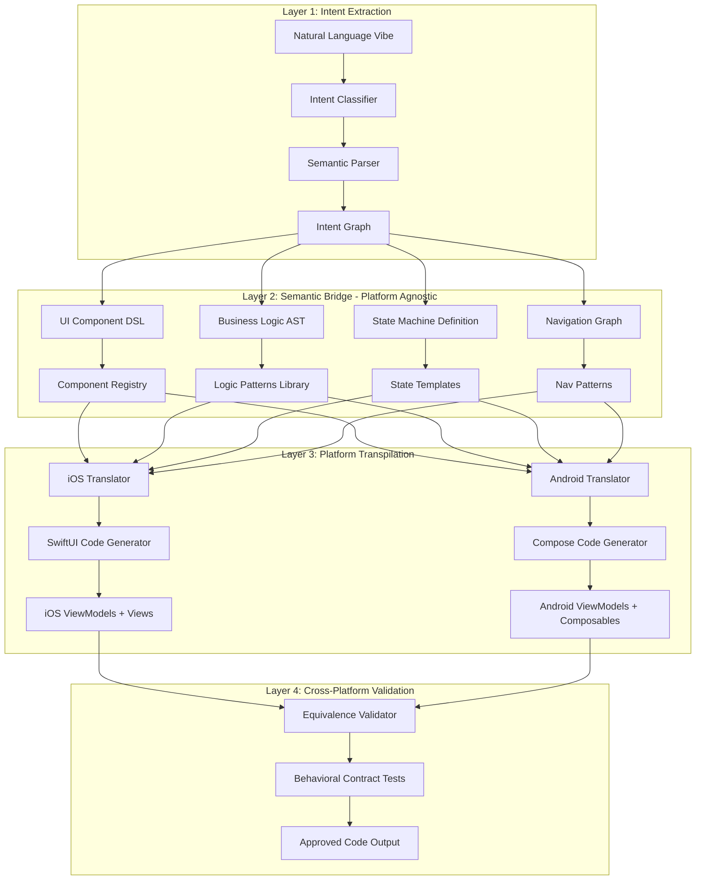
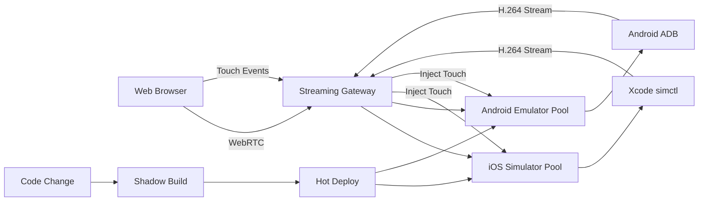
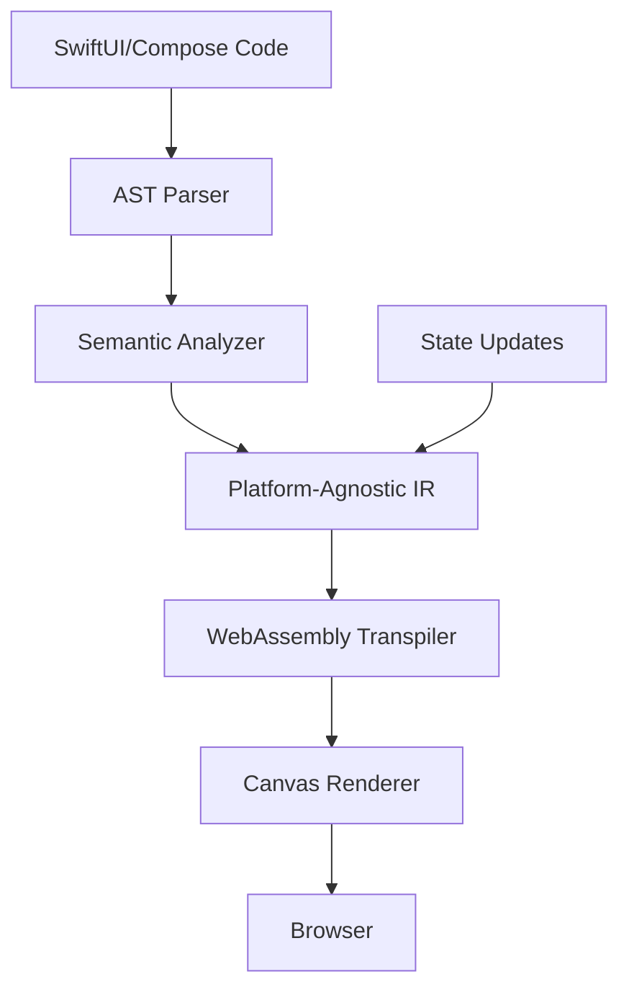
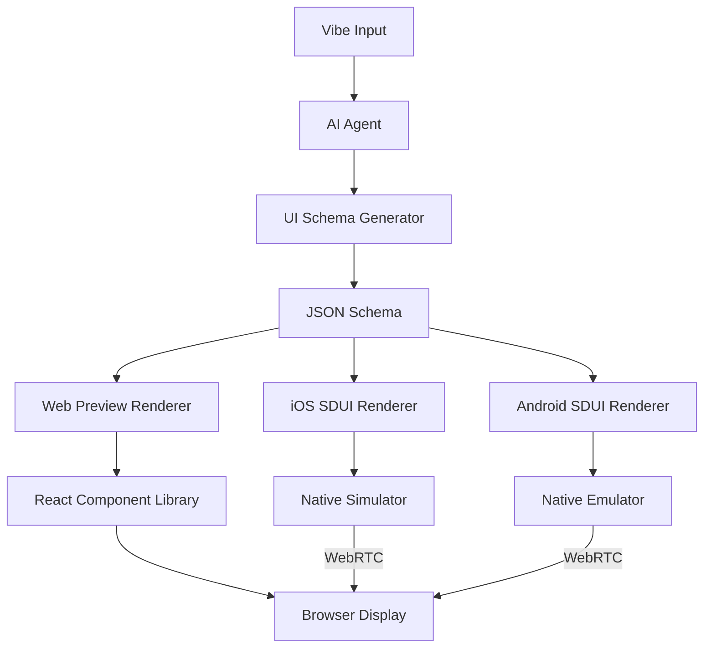
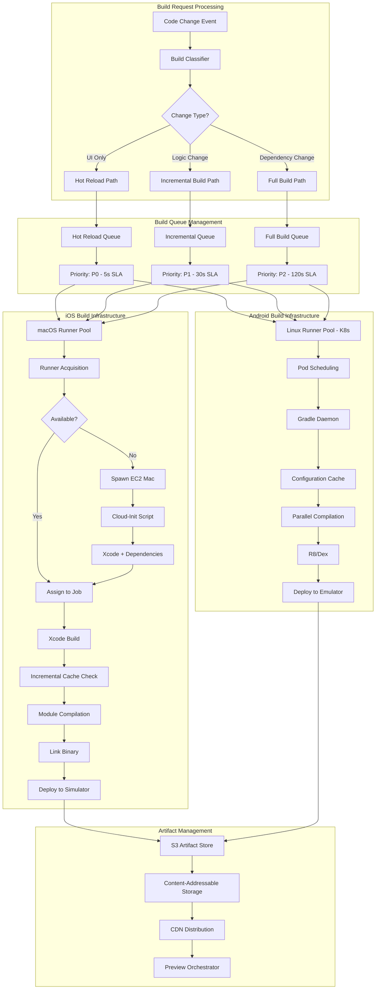
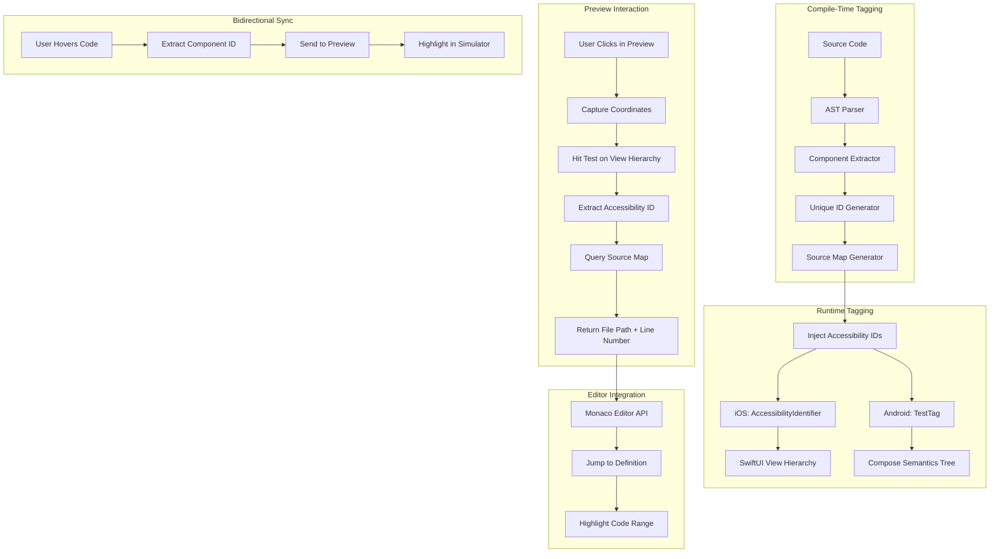
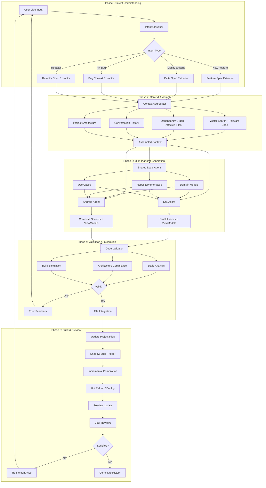
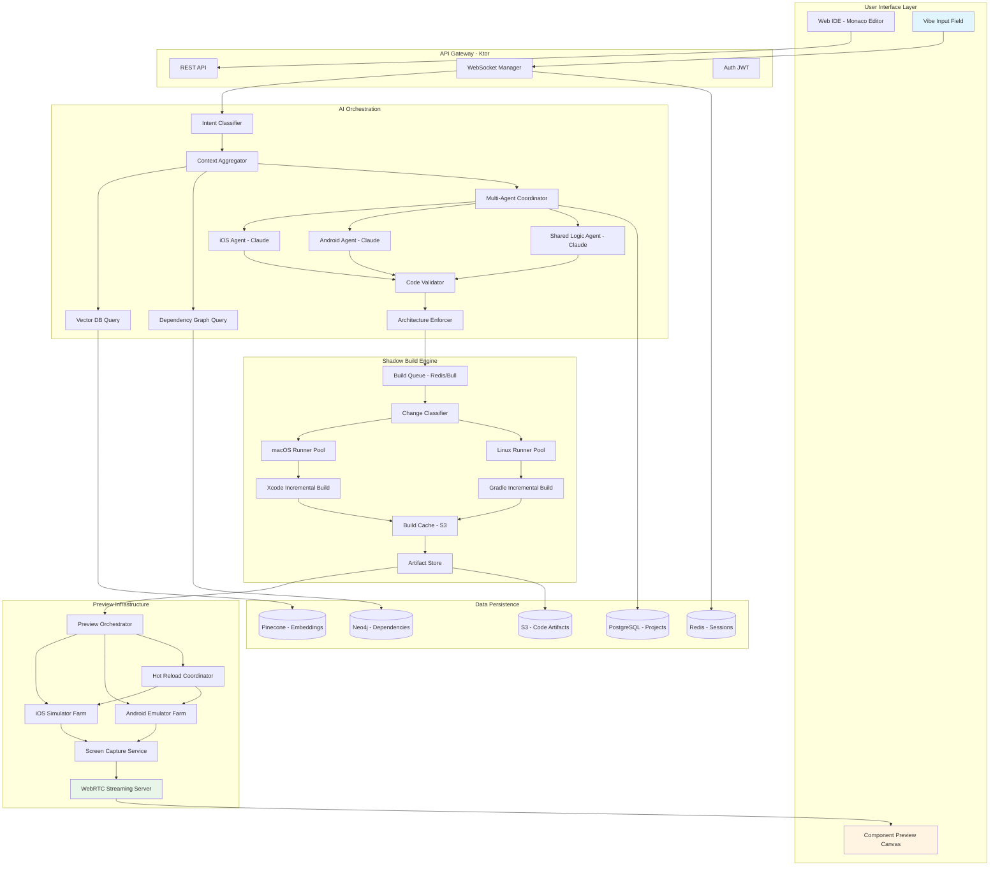
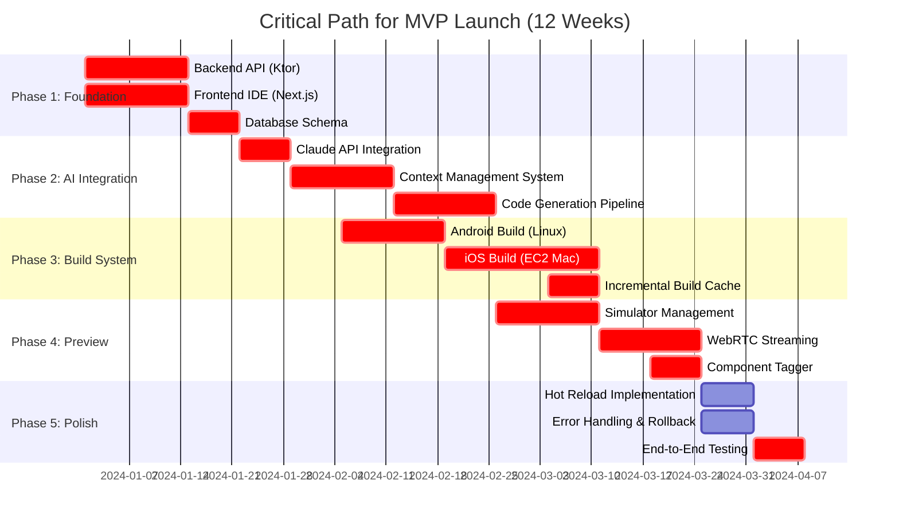

# Vibe Coding Platform: Product Requirements Document (PRD)

## Executive Summary

This PRD outlines the technical architecture for a "Vibe Coding" platform that translates natural language prompts into synchronized, production-ready native mobile applications for iOS (SwiftUI) and Android (Jetpack Compose). The platform provides instant visual feedback through a web-based preview system while maintaining native code quality and platform-specific idioms.

---

## 1. Dual-Path Code Generation Engine

### 1.1 Semantic Bridge Architecture

The Semantic Bridge is a three-layer abstraction system that transforms natural language into platform-specific native code while maintaining functional equivalence.



#### Component Registry Structure

**Internal Representation (Platform-Agnostic DSL):**

```yaml
ComponentSpec:
  type: "TextInput"
  id: "email_field"
  properties:
    label: "Email Address"
    inputType: "email"
    validation:
      - required: true
      - pattern: "email"
    state_binding: "viewModel.email"
    accessibility:
      label: "Email input field"
      hint: "Enter your email address"
  styling:
    cornerRadius: "medium"
    borderStyle: "outline"
    keyboardType: "emailAddress"
  events:
    onChange: "viewModel.onEmailChanged"
    onSubmit: "viewModel.validateEmail"
```

**Mapping Tables:**

| Semantic Component | iOS SwiftUI | Android Compose | Behavioral Contract |
|-------------------|-------------|-----------------|---------------------|
| TextInput | TextField | TextField | value binding, onChange callback, validation state |
| Button | Button | Button | onClick handler, enabled state, loading state |
| List | List | LazyColumn | data source, item template, scroll state |
| NavigationContainer | NavigationStack | NavHost | route graph, deep linking, back stack |
| StateContainer | @StateObject | remember + ViewModel | state persistence, lifecycle awareness |

#### Functional Parity Guarantees

**1. State Synchronization Contract:**

Each UI component must adhere to a behavioral contract that defines:
- Input/Output interface (what data flows in, what events flow out)
- State transitions (loading → success → error)
- Side effects (navigation, network calls, storage)
- Lifecycle hooks (appear, disappear, background)

**2. Platform-Specific Adaptation Layer:**

While maintaining functional equivalence, the system respects platform conventions:

**iOS Adaptations:**
- Use SF Symbols for icons
- Follow Human Interface Guidelines spacing (8pt grid)
- Implement native gestures (swipe to delete, pull to refresh)
- Use iOS-native date pickers, action sheets

**Android Adaptations:**
- Use Material Design 3 components
- Follow Material spacing guidelines (4dp grid)
- Implement FAB, Bottom Navigation, Snackbar patterns
- Use Android-native date pickers, bottom sheets

**Implementation Strategy:**

The Semantic Bridge contains a "Platform Idiom Adapter" that injects platform-specific enhancements:

```
Semantic DSL: "Show success message"
↓
iOS Adapter: Generate Alert with SF Symbol checkmark
Android Adapter: Generate Snackbar with Material icon
↓
Both: Trigger same state transition (showSuccess = true)
```

**3. Behavioral Equivalence Validation:**

Auto-generated contract tests verify functional parity:

```gherkin
Feature: Login Button Behavior
  Scenario: User taps login with valid credentials
    Given email field contains "user@example.com"
    And password field contains "validpass123"
    When user taps "Login" button
    Then button shows loading state
    And network request is made to "/auth/login"
    And on success, navigate to "Dashboard" screen
    And on failure, show error message
    
  Platform: iOS (SwiftUI)
  Platform: Android (Compose)
  Expected: Identical state transitions and side effects
```

### 1.2 Cross-Platform State Management

**Shared State Architecture:**

The platform uses a "Shared State Contract" pattern where ViewModels on both platforms implement identical interfaces:

```
StateContract: LoginViewModel
  Properties:
    - email: String (observable)
    - password: String (observable)
    - isLoading: Boolean (observable)
    - errorMessage: String? (observable)
  
  Actions:
    - onEmailChanged(String)
    - onPasswordChanged(String)
    - onLoginTapped()
  
  Effects:
    - navigateToHome()
    - showError(String)
```

**iOS Implementation Pattern:**
- ObservableObject protocol
- @Published properties
- Combine publishers for effects

**Android Implementation Pattern:**
- ViewModel class
- StateFlow/MutableStateFlow
- SharedFlow for one-time effects

**Synchronization Mechanism:**

The AI generates both implementations from a single logical specification, ensuring:
1. Identical state properties
2. Identical action signatures
3. Identical side effect triggers
4. Platform-appropriate reactive patterns

---

## 2. The "Shadow Live" Preview Engine

### 2.1 Comparative Analysis of Preview Strategies

#### Option A: Remote Streaming (RECOMMENDED)

**Architecture:**



**Technical Implementation:**

**Simulator Management:**
- Maintain warm pool of 20-50 simulators/emulators
- Pre-boot with base project template
- Assign simulator to user session on demand
- Recycle after 30 minutes of inactivity

**Screen Capture:**
- iOS: Use `xcrun simctl io booted recordVideo` with streaming mode
- Android: Use `adb shell screenrecord --bit-rate 2M --output-format h264`
- Encode at 30 FPS, 720p resolution
- Hardware-accelerated H.264 encoding

**WebRTC Streaming:**
- Implement custom SFU (Selective Forwarding Unit)
- Use Opus for audio (if needed for demos)
- Implement adaptive bitrate based on network conditions
- Target latency: 100-200ms

**Bidirectional Interaction:**
- Capture mouse/touch events in browser
- Transform coordinates to simulator screen space
- Inject via simctl/ADB touch events
- Support multi-touch gestures

**Pros:**
✓ 100% native fidelity - true iOS/Android rendering
✓ Full access to device capabilities (sensors, storage, location mocking)
✓ No cross-compilation complexity
✓ Supports all native APIs without limitation
✓ Can debug with native tools (Xcode debugger, Android Profiler)

**Cons:**
✗ Infrastructure cost: ~$0.50-1.00 per active hour per user
✗ Latency: 100-300ms baseline (acceptable for preview, not gaming)
✗ Scaling complexity: Need to manage simulator pool
✗ macOS dependency for iOS

**Cost Optimization:**
- Share simulator instances across users during idle periods
- Use spot instances for Android emulators
- Implement aggressive simulator recycling
- Scale down during off-peak hours

---

#### Option B: Transpilation (EXPERIMENTAL)

**Architecture:**



**Technical Approach:**

**Skip Framework Strategy:**
- Use Skip (SwiftUI to Kotlin) as inspiration
- Build custom transpiler: SwiftUI/Compose → Intermediate Representation → React/Canvas
- Implement subset of UI components (Button, Text, Image, List, TextField)
- Map state management to JavaScript observables

**Rendering Engine:**
- Implement layout engine (Flexbox/Grid for approximation)
- Use HTML Canvas or WebGL for pixel-perfect rendering
- Polyfill platform-specific components
- Handle gestures via pointer events

**Pros:**
✓ Near-instant preview (no build time)
✓ Lower infrastructure cost (runs in browser)
✓ Works offline after initial load
✓ Can run on any device

**Cons:**
✗ Massive engineering effort (6-12 month minimum)
✗ Incomplete API coverage - many native features unsupported
✗ Visual approximation, not pixel-perfect
✗ Divergence from actual native behavior
✗ Maintenance burden: must keep transpiler updated with SwiftUI/Compose changes
✗ Performance limitations for complex UIs

**Verdict:** Not recommended for MVP. Consider for Phase 2 if instant preview becomes critical differentiator.

---

#### Option C: Server-Driven UI (HYBRID APPROACH)

**Architecture:**



**Technical Implementation:**

**Schema-Driven Rendering:**

```json
{
  "screen": "LoginScreen",
  "components": [
    {
      "id": "email_field",
      "type": "TextField",
      "props": {
        "label": "Email",
        "inputType": "email",
        "binding": "viewModel.email"
      }
    },
    {
      "id": "login_button",
      "type": "Button",
      "props": {
        "label": "Log In",
        "action": "viewModel.login",
        "enabled": "viewModel.isValid"
      }
    }
  ],
  "layout": {
    "type": "VStack",
    "spacing": 16,
    "padding": 20
  }
}
```

**Three-Way Rendering:**
1. **Native iOS:** SDUI library interprets schema → SwiftUI components
2. **Native Android:** SDUI library interprets schema → Compose components
3. **Web Preview:** React components render schema approximation

**Pros:**
✓ Fast web preview (renders immediately from schema)
✓ Can show approximate UI before native build completes
✓ Easier to implement component tagging
✓ Single source of truth for UI structure

**Cons:**
✗ Limited to SDUI-supported components
✗ Complex interactions harder to represent in schema
✗ Still need native build for production code
✗ Web preview is approximation, not true native
✗ Additional abstraction layer increases complexity

**Use Case:** Hybrid approach where SDUI provides instant (but approximate) preview while native build runs in background.

---

### 2.2 Recommended Architecture: Hybrid Streaming + SDUI

**Strategy:**

1. **Instant Feedback (0-500ms):** SDUI-based web preview shows approximation
2. **Native Preview (10-45s):** Shadow build completes, WebRTC stream replaces SDUI
3. **Hot Reload (1-3s):** Subsequent UI-only changes use hot reload on active simulator

**Implementation Timeline:**

**Phase 1 (MVP):** Pure WebRTC streaming from simulators
**Phase 2:** Add SDUI instant preview as progressive enhancement
**Phase 3:** Add transpilation for offline mode (optional)

---

## 3. Cloud Build Orchestration

### 3.1 Ephemeral Build Runner Architecture



### 3.2 Incremental Native Compilation Strategy

#### Change Classification System

**Hot Reloadable Changes (Target: 1-3 seconds):**
- SwiftUI view body modifications
- Compose @Composable function content
- Color/string/dimension constants
- Padding, spacing, alignment values

**Warm Reload Changes (Target: 10-30 seconds):**
- New view functions
- ViewModel property additions
- New composable functions
- Navigation route additions

**Cold Build Changes (Target: 45-120 seconds):**
- Dependency updates
- New external libraries
- Build configuration changes
- Code signing modifications

#### iOS Incremental Build Optimization

**Xcode Build System Leverage:**

**Module-Level Caching:**
- Use explicit modules to enable fine-grained dependency tracking
- Implement content-based caching (hash of source files)
- Store compiled modules in S3 by content hash
- On build request, check cache before compiling

**Build Graph Optimization:**
- Analyze dependency graph to determine affected modules
- Only rebuild modules with changed sources or dependencies
- Use `xcodebuild` with `-onlyUsePackageVersionsFromResolvedFile`
- Parallelize independent module builds

**Preview-Specific Build Target:**

Create separate build scheme optimized for preview:
- Disable optimization (-Onone)
- Skip code signing
- Exclude unused frameworks
- Use simulator-only architecture (x86_64 or arm64)
- Disable bitcode and debug symbol generation

**Incremental Compilation Flags:**

Use Xcode build settings:
- `SWIFT_COMPILATION_MODE = incremental`
- `SWIFT_OPTIMIZATION_LEVEL = -Onone`
- `ENABLE_BITCODE = NO`
- `DEBUG_INFORMATION_FORMAT = dwarf`

**Build Time Breakdown (Optimized):**
- Dependency resolution: 2-5s (cached)
- Changed module compilation: 5-15s
- Linking: 3-8s
- Deployment to simulator: 2-5s
- **Total: 12-33s for incremental builds**

#### Android Incremental Build Optimization

**Gradle Configuration Cache:**

Enable advanced caching:
- Configuration cache (Gradle 8+)
- Build cache (local + remote)
- Incremental annotation processing
- Parallel execution

**Gradle Daemon Management:**

**Persistent Daemon Strategy:**
- Maintain warm Gradle daemon pool (10-20 daemons)
- Pre-load project dependencies
- Keep daemon alive for 30 minutes
- Reuse daemon across user sessions with different projects (isolated builds)

**Module Isolation:**

**Modular Architecture:**
- Feature modules (`:feature:login`, `:feature:dashboard`)
- Core modules (`:core:ui`, `:core:network`)
- Only rebuild affected modules based on change detection

**Incremental Compose:**

Leverage Compose compiler optimizations:
- Compose compiler caching
- Skippable composables
- Stable types optimization
- Strong skipping mode

**Build Cache Strategy:**

**Remote Build Cache:**
- S3-backed Gradle build cache
- Content-addressable storage
- Shared across all build agents
- Cache hit rate target: 80%+

**Optimization Flags:**

```gradle
org.gradle.caching=true
org.gradle.parallel=true
org.gradle.configureondemand=true
org.gradle.daemon=true
org.gradle.jvmargs=-Xmx4g -XX:MaxMetaspaceSize=1g -XX:+HeapDumpOnOutOfMemoryError
kotlin.incremental=true
kotlin.incremental.usePreciseJavaTracking=true
```

**Build Time Breakdown (Optimized):**
- Daemon startup: 0-2s (warm daemon)
- Configuration: 1-3s (cached)
- Changed module compilation: 5-12s
- R8/Dex: 2-5s (incremental)
- Deployment to emulator: 2-4s
- **Total: 10-26s for incremental builds**

### 3.3 Build Runner Lifecycle Management

#### Warm Pool Strategy

**macOS Runners (EC2 Mac):**
- Maintain 5-10 always-on instances during business hours
- Auto-scale to 20-30 during peak (based on queue depth)
- Scale down to 2-3 during off-peak
- Instance reuse: 8-hour maximum, then recycle
- Pre-configuration: Xcode, dependencies, base project template

**Linux Runners (Kubernetes):**
- Baseline: 10 pods with Gradle daemon warm
- Auto-scale: 50-100 pods maximum
- Pod affinity: Prefer nodes with cached dependencies
- Pod preemption: Low-priority full builds yield to high-priority incremental builds

#### Build Request Routing

**Intelligent Routing:**
- Route to runner with highest cache hit probability
- Consider: project ID, dependency hash, recent build history
- Prefer runner with warm daemon for same project
- Load balance across available runners

**SLA Enforcement:**
- P0 (hot reload): 5-second SLA - preempt lower priority builds if needed
- P1 (incremental): 30-second SLA - standard queue
- P2 (full build): 120-second SLA - overflow to GitHub Actions if queue saturated

---

## 4. Visual Selection & Tagging (Component Tagger)

### 4.1 Component Identification System



### 4.2 iOS Implementation (SwiftUI)

#### Compile-Time Instrumentation

**AST Parsing Strategy:**

During code generation, the AI embeds unique identifiers:

```
// Generated SwiftUI code
Button("Log In") {
    viewModel.login()
}
.accessibilityIdentifier("component_login_button_1a2b3c")
```

**Source Map Generation:**

Create JSON mapping file during generation:

```json
{
  "component_login_button_1a2b3c": {
    "file": "ios/App/UI/Screens/LoginScreen.swift",
    "line": 45,
    "column": 12,
    "type": "Button",
    "semantic_path": "LoginScreen.VStack.Button"
  }
}
```

#### Runtime View Hierarchy Traversal

**Accessibility Inspector Integration:**

Use Xcode's accessibility inspector APIs via simctl:

```bash
xcrun simctl spawn booted \
  /System/Library/PrivateFrameworks/XCTAutomationSupport.framework/XCTAutomationSupport \
  dump-accessibility-tree
```

**Touch Event Mapping:**

1. User clicks at coordinates (x, y) in web preview
2. WebRTC client sends coordinates to backend
3. Backend executes hit test on simulator:
   ```bash
   xcrun simctl ui booted tap x y
   ```
4. Simultaneously query accessibility tree at coordinates
5. Extract `accessibilityIdentifier` of tapped element
6. Look up identifier in source map
7. Return file path + line number to frontend

### 4.3 Android Implementation (Jetpack Compose)

#### Compose Semantics Integration

**Test Tag Injection:**

During code generation, embed test tags:

```
// Generated Compose code
Button(
    onClick = { viewModel.login() },
    modifier = Modifier.testTag("component_login_button_1a2b3c")
) {
    Text("Log In")
}
```

#### Semantics Tree Traversal

**ADB Integration:**

Use UI Automator to dump semantics tree:

```bash
adb shell uiautomator dump --compressed /sdcard/hierarchy.xml
adb pull /sdcard/hierarchy.xml
```

**Coordinate-to-Component Mapping:**

1. User clicks at coordinates (x, y) in web preview
2. Parse hierarchy.xml to find view at coordinates
3. Extract `content-desc` or `resource-id` (contains test tag)
4. Look up in source map
5. Return file path + line number

**Real-Time Updates:**

Implement WebSocket bridge in Android app that sends semantics tree updates:

```kotlin
// Injected into preview build
class SemanticsReporter {
    init {
        val socket = IO.socket("wss://preview.vibe.dev")
        
        composeView.onSemanticsChange { tree ->
            val semanticsJson = tree.toJson()
            socket.emit("semantics_update", semanticsJson)
        }
    }
}
```

### 4.4 Bidirectional Highlighting

#### Code → Preview Highlighting

**Monaco Editor Integration:**

1. User hovers over line in Monaco Editor
2. Frontend parses AST to find component at cursor position
3. Extract component ID from accessibility tag
4. Send highlight command to preview:
   ```json
   {
     "action": "highlight",
     "component_id": "component_login_button_1a2b3c",
     "duration": 2000
   }
   ```

**Simulator Overlay:**

Inject overlay layer in preview app:
- iOS: SwiftUI overlay with `GeometryReader` to calculate bounds
- Android: Compose overlay with layout coordinates
- Draw semi-transparent border around highlighted component

#### Preview → Code Navigation

**Deep Linking to Editor:**

When user selects component in preview:
1. Extract component ID and source location
2. Send navigation event to frontend:
   ```json
   {
     "action": "navigate",
     "file": "LoginScreen.swift",
     "line": 45,
     "column": 12
   }
   ```
3. Monaco Editor API jumps to location:
   ```typescript
   editor.revealLineInCenter(45)
   editor.setPosition({ lineNumber: 45, column: 12 })
   editor.deltaDecorations([], [
     {
       range: new monaco.Range(45, 12, 45, 50),
       options: { className: 'highlighted-component' }
     }
   ])
   ```

---

## 5. Integrated AI Agent Workflow

### 5.1 Conversation-to-Commit Loop



### 5.2 State Management Synchronization

#### Challenge: Cross-Platform ViewModel Coherence

**Problem:**
- iOS uses Combine + ObservableObject
- Android uses Kotlin Flows + ViewModel
- Must maintain identical state logic across platforms
- Any divergence breaks functional parity

**Solution: Shared State Contract Generation**

**Step 1: Extract State Requirements**

From user vibe: "Add loading state to login screen"

AI extracts:
```yaml
state_changes:
  - add_property:
      name: "isLoading"
      type: "Boolean"
      initial_value: false
  - add_action:
      name: "onLoginTapped"
      updates:
        - set: "isLoading = true"
        - call: "authRepository.login(email, password)"
        - on_success: 
            - set: "isLoading = false"
            - navigate: "HomeScreen"
        - on_error:
            - set: "isLoading = false"
            - set: "errorMessage = error.message"
```

**Step 2: Generate Platform-Specific ViewModels**

**iOS ViewModel Generation:**

```swift
class LoginViewModel: ObservableObject {
    @Published var email: String = ""
    @Published var password: String = ""
    @Published var isLoading: Bool = false
    @Published var errorMessage: String? = nil
    
    private let authRepository: AuthRepository
    private var cancellables = Set<AnyCancellable>()
    
    func onLoginTapped() {
        isLoading = true
        
        authRepository.login(email: email, password: password)
            .receive(on: DispatchQueue.main)
            .sink { [weak self] completion in
                self?.isLoading = false
                if case .failure(let error) = completion {
                    self?.errorMessage = error.localizedDescription
                }
            } receiveValue: { [weak self] _ in
                // Navigate to home - handled by coordinator
            }
            .store(in: &cancellables)
    }
}
```

**Android ViewModel Generation:**

```kotlin
class LoginViewModel(
    private val authRepository: AuthRepository
) : ViewModel() {
    
    private val _email = MutableStateFlow("")
    val email: StateFlow<String> = _email.asStateFlow()
    
    private val _password = MutableStateFlow("")
    val password: StateFlow<String> = _password.asStateFlow()
    
    private val _isLoading = MutableStateFlow(false)
    val isLoading: StateFlow<Boolean> = _isLoading.asStateFlow()
    
    private val _errorMessage = MutableStateFlow<String?>(null)
    val errorMessage: StateFlow<String?> = _errorMessage.asStateFlow()
    
    private val _navigationEffect = MutableSharedFlow<NavigationEffect>()
    val navigationEffect: SharedFlow<NavigationEffect> = _navigationEffect.asSharedFlow()
    
    fun onLoginTapped() {
        viewModelScope.launch {
            _isLoading.value = true
            
            authRepository.login(email.value, password.value)
                .onSuccess {
                    _isLoading.value = false
                    _navigationEffect.emit(NavigationEffect.NavigateToHome)
                }
                .onFailure { error ->
                    _isLoading.value = false
                    _errorMessage.value = error.message
                }
        }
    }
}
```

**Step 3: Equivalence Validation**

Generate contract test:

```kotlin
// Shared test (runs on both platforms via KMP test)
class LoginViewModelContractTest {
    @Test
    fun `login with valid credentials shows loading then navigates`() = runTest {
        // Arrange
        val mockRepository = MockAuthRepository()
        val viewModel = createLoginViewModel(mockRepository)
        
        // Act
        viewModel.onLoginTapped()
        
        // Assert
        assertEquals(true, viewModel.isLoading.value)
        
        advanceTimeBy(1000) // Simulate network delay
        
        assertEquals(false, viewModel.isLoading.value)
        assertTrue(viewModel.navigationEffect.lastEmitted is NavigateToHome)
    }
}
```

### 5.3 Build Break Prevention

#### Pre-Generation Validation

**Before generating code, AI performs:**

**1. Dependency Check:**
- Verify all imported modules exist
- Check if new dependencies need to be added to build files
- Validate version compatibility

**2. Architecture Compliance:**
- Ensure new code follows Repository pattern
- Verify ViewModel doesn't make direct API calls
- Check navigation graph validity

**3. Type Safety:**
- Validate state types match across platforms
- Ensure function signatures are compatible
- Check nullability annotations

**4. Build Simulation:**
- Run AST-based build simulation (no actual compilation)
- Detect potential compilation errors
- Identify missing imports or undefined references

#### Rollback Strategy

**If generated code breaks build:**

**Automatic Rollback:**
1. Build fails with compilation error
2. System captures error message
3. Rolls back to last known good state
4. Feeds error back to AI agent
5. AI generates fix with error context
6. User approves fix before applying

**Error Context Injection:**

```
Previous generation failed with error:
"Type 'AuthRepository' not found in scope"

Context:
- User requested: "Add forgot password functionality"
- Generated code attempted to inject AuthRepository
- AuthRepository interface exists but wasn't imported

Action: Re-generate with proper import statement
```

### 5.4 Conversation Memory & Learning

#### Short-Term Conversation Context

**Maintain for current session:**
- Last 10 user vibes
- Generated code diffs
- User feedback (approved/rejected changes)
- Build errors and fixes

**Context Window Management:**

As conversation grows:
1. Summarize older exchanges
2. Keep only relevant code context
3. Maintain architecture decisions
4. Preserve user preferences

#### Long-Term Project Memory

**Store in vector database:**
- Common patterns used in this project
- User coding style preferences
- Architectural decisions
- Frequently modified components

**Retrieval-Augmented Generation:**

Before generating code:
1. Query vector DB for similar past vibes
2. Retrieve successful code patterns
3. Check if user previously rejected similar approaches
4. Adapt generation based on project history

---

## 6. End-to-End Data Flow



---

## 7. Recommended Tech Stack

### 7.1 Frontend Stack

| Layer | Technology | Rationale |
|-------|-----------|-----------|
| **Framework** | Next.js 14 (App Router) | Server components, streaming, edge runtime |
| **UI Components** | Radix UI + Tailwind CSS | Accessible primitives, rapid styling |
| **Code Editor** | Monaco Editor | VSCode engine, syntax highlighting, IntelliSense |
| **State Management** | Zustand | Lightweight, no boilerplate, TypeScript support |
| **Real-Time** | Socket.io Client | WebSocket with auto-reconnect, room support |
| **Streaming** | WebRTC (simple-peer) | Low-latency video streaming, bidirectional |
| **Build Tool** | Turbopack | 700x faster than Webpack |
| **Type Safety** | TypeScript 5+ | Static typing, enhanced editor support |
| **Testing** | Playwright | E2E testing for editor interactions |
| **Hosting** | Vercel | Native Next.js hosting, edge functions, global CDN |

### 7.2 Backend Stack

| Layer | Technology | Rationale |
|-------|-----------|-----------|
| **Framework** | Ktor 2.3+ (Kotlin) | Coroutine-based, lightweight, type-safe |
| **API Design** | Ktor Resources | Type-safe routing, automatic OpenAPI generation |
| **WebSockets** | Ktor WebSockets | Native support, coroutine integration |
| **Authentication** | Ktor Auth JWT + OAuth | Stateless auth, social login support |
| **Validation** | Ktor RequestValidation | Schema validation, input sanitization |
| **Serialization** | kotlinx.serialization | Compile-time safe, fast JSON processing |
| **Database ORM** | Exposed (Kotlin SQL) | Type-safe SQL, coroutine support |
| **HTTP Client** | Ktor Client | For Claude API, GitHub API calls |
| **Logging** | kotlin-logging + Logback | Structured logging, log aggregation |
| **Metrics** | Micrometer + Prometheus | Time-series metrics, Grafana visualization |
| **Deployment** | GKE (Google Kubernetes Engine) | Auto-scaling, multi-region, managed K8s |

### 7.3 AI Orchestration Stack

| Component | Technology | Rationale |
|-----------|-----------|-----------|
| **Primary LLM** | Claude 3.5 Sonnet (Anthropic) | 200K context, superior code generation, tool use |
| **Code Analysis** | Tree-sitter | Fast, incremental, language-agnostic parsing |
| **Embeddings** | Voyage Code 2 | Optimized for code similarity, 16K context |
| **Vector Store** | Pinecone Serverless | Low latency, managed, auto-scaling |
| **Graph Database** | Neo4j Aura | Managed, Cypher query language, APOC library |
| **Prompt Management** | LangChain4j (Kotlin) | Structured prompts, output parsing, memory |
| **Agent Framework** | Custom (Ktor + Claude) | Full control, optimized for mobile code gen |
| **Code Formatting** | ktfmt (Android), SwiftFormat (iOS) | Consistent code style enforcement |

### 7.4 Cloud Infrastructure Stack

| Component | Technology | Rationale |
|-----------|-----------|-----------|
| **Container Orchestration** | Kubernetes (GKE) | Industry standard, robust ecosystem |
| **iOS Build Runners** | AWS EC2 Mac (mac2.metal) | Only cloud macOS option at scale |
| **Android Build Runners** | GKE with n2-standard-8 nodes | Cost-effective, KVM support for emulators |
| **Object Storage** | Google Cloud Storage + CDN | Multi-region, versioning, lifecycle policies |
| **Database** | Cloud SQL (PostgreSQL 15) | Managed, automated backups, read replicas |
| **Cache** | Memorystore (Redis 7) | Managed Redis, VPC peering, high availability |
| **Message Queue** | Cloud Tasks + Bull | Reliable job processing, retry logic |
| **Build Cache** | Self-hosted Gradle Enterprise + S3 | Remote build cache, analytics dashboard |
| **Monitoring** | Datadog | Unified observability, APM, log aggregation |
| **CI/CD** | GitHub Actions | Native integration, macOS runners available |
| **Secrets** | Google Secret Manager | Automatic rotation, IAM integration, audit logs |
| **CDN** | Cloudflare | Global edge network, DDoS protection |

### 7.5 Mobile Build Tools Stack

| Component | Technology | Rationale |
|-----------|-----------|-----------|
| **iOS Build** | Xcode 15+ (Command Line Tools) | Required for SwiftUI compilation |
| **Android Build** | Gradle 8.5+ with Kotlin 1.9+ | Modern build system, configuration cache |
| **Dependency Management** | Swift Package Manager, Gradle | Native dependency resolution |
| **Testing** | XCTest (iOS), JUnit + Espresso (Android) | Native testing frameworks |
| **Static Analysis** | SwiftLint 0.54+, Detekt 1.23+ | Code quality enforcement |
| **Deployment Automation** | Fastlane 2.217+ | Cross-platform CI/CD automation |
| **Crash Reporting** | Firebase Crashlytics | Real-time crash analytics, symbolication |
| **Analytics** | Firebase Analytics + Mixpanel | User behavior tracking, funnel analysis |
| **Performance Monitoring** | Firebase Performance Monitoring | Network, app startup, screen rendering metrics |

---

## 8. Critical Path Analysis

### 8.1 Critical Path Identification



**Critical Path (cannot be delayed without extending timeline):**

1. **Backend API + Frontend IDE** (Week 1-2): Foundation must be solid
2. **Claude Integration + Context System** (Week 3-6): Core AI capability
3. **iOS Build System** (Week 7-9): Longest pole, macOS dependency
4. **WebRTC Streaming** (Week 10-11): Essential for preview experience
5. **End-to-End Testing** (Week 12): Validate entire flow before launch

**Parallelizable Workstreams:**
- Android build system can develop in parallel with iOS
- Frontend IDE polish can happen alongside backend work
- Component tagger can develop while streaming is being built

---

## 9. Top 3 Technical Risks

### Risk 1: iOS Build Infrastructure Cost & Latency

**Risk Description:**

**Cost Dimension:**
- EC2 Mac instances cost $0.97-1.08/hour (mac2.metal)
- 1000 concurrent users × 8 hours/day = 8000 instance-hours/day
- Monthly cost: ~$250K for build infrastructure alone
- Unpredictable scaling costs during viral growth

**Latency Dimension:**
- EC2 Mac has 5-10 minute cold start time
- Xcode full builds take 2-5 minutes even on powerful hardware
- User expectation: <30 second feedback loop
- 95th percentile latency could exceed 90 seconds, causing churn

**Technical Constraints:**
- macOS required for iOS builds (no Linux alternative)
- Limited cloud providers (AWS only, no GCP/Azure Mac instances)
- Cannot horizontally scale as easily as Linux containers
- Xcode version updates require manual instance updates

**Impact:**
- **Severity**: HIGH (potential business killer)
- **Probability**: HIGH (will definitely occur at scale)
- **Blast Radius**: Affects every iOS user, every build

**Mitigation Strategies:**

**Strategy 1: Aggressive Incremental Builds (Reduces latency by 60-70%)**

**Implementation:**
- Implement content-addressable module caching
- Only rebuild changed SwiftUI views, not entire app
- Use Xcode's "Preview Mode" which skips optimization
- Maintain hot pool of pre-built base templates
- Target: 15-30 second incremental builds for UI changes

**Expected Outcome:**
- 70% of builds complete in <30 seconds
- 90% of builds complete in <60 seconds
- 5% full builds allowed to take 120+ seconds

**Strategy 2: Hybrid Cloud + Bare Metal (Reduces cost by 50%)**

**Implementation:**
- Baseline capacity: 10 dedicated Mac minis ($5K upfront, $0 ongoing)
- Burst capacity: EC2 Mac instances for peak traffic
- Use MacStadium for mid-tier stable load ($199/month per server)
- Reserve 5 EC2 Mac instances, scale to 20 during peaks

**Cost Breakdown:**
- Baseline: 10 Mac minis @ $500/month hosting = $5K/month
- Burst: 5-15 EC2 Mac @ $780/month average = $5K-12K/month
- **Total: $10K-17K/month** (vs $250K pure EC2)

**Strategy 3: Preview-Specific Build Optimization (Reduces build time by 50%)**

**Implementation:**
- Skip code signing for preview builds (saves 10-15 seconds)
- Disable bitcode and debug symbols (saves 20-30%)
- Use simulator-only target (no device support)
- Lazy-load frameworks (don't link until runtime)

**Expected Outcome:**
- Preview builds 50% faster than release builds
- Smaller binary size (faster deployment)

**Strategy 4: Build Prediction & Pre-Warming (Perceived latency <5 seconds)**

**Implementation:**
- ML model predicts next likely user change
- Pre-compile common UI patterns speculatively
- Start build during user typing (debounced)
- By time user hits "Generate", build is 60-80% complete

**User Experience:**
- Perceived latency: 5-10 seconds
- Actual latency: 30-45 seconds (but hidden)

**Contingency Plan:**

If costs still exceed budget:
- Implement build credits system (free tier: 100 builds/month)
- Charge premium users for unlimited builds
- Queue non-premium builds during off-peak hours
- Partner with MacStadium for volume discounts

**Success Metrics:**
- Average build cost per user: <$5/month
- P95 build latency: <60 seconds
- Infrastructure cost as % of revenue: <20%

---

### Risk 2: AI Context Window Saturation

**Risk Description:**

**Scaling Problem:**
- Typical mobile app: 50-200 files (500K-2M tokens if all included)
- Claude 3.5 Sonnet: 200K token context limit
- As projects grow, impossible to fit entire codebase
- AI needs sufficient context to maintain architectural consistency

**Quality Degradation:**
- Insufficient context → hallucinated imports, wrong function signatures
- Overstuffed context → diluted focus, generic outputs
- Multi-turn conversations → context grows exponentially
- Large projects (200+ files) → impossible to generate coherent changes

**Impact:**
- **Severity**: HIGH (directly affects core product value)
- **Probability**: MEDIUM (will occur as users build larger apps)
- **Blast Radius**: Affects power users, enterprise customers

**Mitigation Strategies:**

**Strategy 1: Intelligent Context Pruning via Semantic Search (80% context reduction)**

**Implementation:**

**Embedding-Based Retrieval:**
1. Generate embeddings for all code files using Voyage Code 2
2. Store in Pinecone with metadata (file path, type, dependencies)
3. When user submits vibe, embed the prompt
4. Retrieve top-K most semantically similar code chunks
5. Include only relevant files in context window

**Dependency Graph Traversal:**
1. Maintain live dependency graph in Neo4j
2. When modifying a file, traverse graph to find affected files
3. Include direct dependencies only (not transitive)
4. Summarize transitive dependencies (interface signatures only)

**Context Budget Allocation:**
- Global architecture: 10K tokens (navigation, DI, core models)
- Current feature module: 20K tokens (UI, ViewModel, Repository)
- Specific file + dependencies: 15K tokens
- **Total: 45K tokens (leaves 155K for AI response)**

**Strategy 2: Hierarchical Context Summarization**

**Implementation:**

**File-Level Summaries:**
- For files not directly modified, include only:
  - Public interface (function signatures, properties)
  - Type definitions
  - Important comments/documentation
- Skip implementation details

**Example:**
Full file (2000 tokens) → Summary (200 tokens):
```
class LoginViewModel {
  @Published var email: String
  @Published var password: String
  @Published var isLoading: Bool
  func onLoginTapped()
  func validateEmail() -> Bool
}
```

**Strategy 3: Multi-Turn Agentic Workflow (Fresh context per turn)**

**Implementation:**

Break complex changes into subtasks:

**Turn 1: Generate Models**
- Context: Project architecture + existing models
- Output: New domain models and repository interfaces
- Token usage: 30K context + 20K output = 50K total

**Turn 2: Generate ViewModels**
- Context: Project architecture + new models from Turn 1
- Output: ViewModels using new models
- Token usage: 30K context + 25K output = 55K total

**Turn 3: Generate UI**
- Context: ViewModels from Turn 2 + UI patterns
- Output: SwiftUI/Compose screens
- Token usage: 35K context + 30K output = 65K total

Each turn has fresh context budget.

**Strategy 4: Template-Based Generation**

**Implementation:**

Store common patterns as templates:

Instead of including full LoginScreen code (1000 tokens):
```
Template: LoginScreen
Parameters: {email_field, password_field, submit_button}
Variations: {with_biometric, with_social_login, with_2fa}
```

AI fills in parameters rather than generating from scratch.

**Strategy 5: Project-Specific Knowledge Base**

**Implementation:**

During onboarding, create project-specific knowledge:
- Architectural Decision Records (ADRs)
- Common patterns used
- Naming conventions
- Coding style guide

Store in vector DB, retrieve during generation to maintain consistency.

**Fallback Strategy:**

If context still insufficient:
- Switch to Claude Opus 4.5 (400K context) for large projects
- Charge premium for extended context
- Suggest project refactoring to reduce coupling

**Success Metrics:**
- 95% of generations stay within 50K context budget
- Architectural consistency score: >90%
- Hallucination rate: <5%

---

### Risk 3: Preview Latency & User Experience Degradation

**Risk Description:**

**End-to-End Latency Breakdown:**
- User submits vibe: 0ms
- AI generates code: 5-15 seconds
- Shadow build (incremental): 15-45 seconds
- Deploy to simulator: 3-8 seconds
- Screen capture + streaming: 200-500ms
- **Total: 23-68 seconds** (unacceptable for "instant" feedback)

**User Expectations:**
- Web-based tools (Lovable, v0.dev): <3 seconds to preview
- User tolerance threshold: ~10 seconds before frustration
- Beyond 30 seconds: High abandonment risk

**Compounding Factors:**
- Network latency for international users: +500-2000ms
- Simulator boot time if cold: +10-30 seconds
- Build queue wait time during peak: +30-120 seconds
- WebRTC connection establishment: +2-5 seconds

**Impact:**
- **Severity**: CRITICAL (user experience is core differentiator)
- **Probability**: HIGH (will occur on every interaction)
- **Blast Radius**: Affects all users, all the time

**Mitigation Strategies:**

**Strategy 1: Optimistic UI Rendering (Perceived latency: <1 second)**

**Implementation:**

**Client-Side Code Rendering:**
1. AI streams generated code to frontend as it's produced
2. Monaco Editor displays code immediately (0-500ms)
3. Frontend renders code syntax highlighting
4. User sees code before build completes

**Approximate Preview:**
1. Generate JSON schema from code (SwiftUI/Compose → declarative structure)
2. Render approximate web preview using React components
3. Show "Approximate Preview" badge
4. Background: Real native build continues
5. When build completes, swap to real WebRTC stream

**User Experience:**
- User sees code instantly (500ms)
- Sees approximate preview in 2-3 seconds
- Sees native preview in 20-40 seconds
- **Perceived latency: <3 seconds** (acceptable)

**Strategy 2: Aggressive Hot Reload (80% of changes in <3 seconds)**

**Implementation:**

**Change Classification:**

**Hot Reloadable (1-3 seconds):**
- SwiftUI view body modifications
- Compose @Composable content
- Color, string, dimension constants
- Padding, spacing, alignment

**Mechanism:**
- Detect cosmetic-only changes
- Skip full compilation
- Inject code changes directly into running app
- Reload affected views only

**Warm Reload (10-20 seconds):**
- New view functions
- ViewModel property additions
- Minor architectural changes

**Cold Build (30-60 seconds):**
- Dependency changes
- Major architectural shifts

**Success Rate:**
- 80% of user vibes are hot-reloadable
- 15% require warm reload
- 5% require cold build

**Strategy 3: Predictive Pre-Building (Reduces perceived latency by 60%)**

**Implementation:**

**Vibe Analysis During Typing:**
1. User types vibe in input field
2. Backend receives keystroke events (debounced 500ms)
3. Analyze partial vibe to predict intent
4. Pre-fetch relevant code context
5. Start preliminary AI generation
6. When user hits "Generate", process is 40-60% complete

**Build Speculation:**
1. Predict likely code changes based on vibe
2. Speculatively start compilation
3. If prediction correct: Save 15-30 seconds
4. If prediction wrong: Abort and restart (no harm)

**Success Rate:**
- 60% of predictions accurate enough to provide head start
- Average latency reduction: 40%

**Strategy 4: Regional Build Clusters (Reduces network latency by 50%)**

**Implementation:**

**Multi-Region Deployment:**
- Primary: US-East (Virginia)
- Secondary: EU-West (Ireland)
- Tertiary: APAC (Singapore)

**User Routing:**
- Route users to nearest build cluster
- Use latency-based routing (not just geo)
- Fallback to other regions if capacity full

**CDN Integration:**
- Store build artifacts on Cloudflare CDN
- Edge caching for common dependencies
- Reduce download latency by 60-80%

**Expected Outcome:**
- North America: 80-150ms average latency
- Europe: 100-200ms average latency
- Asia: 150-300ms average latency

**Strategy 5: Progressive Streaming & Engagement**

**Implementation:**

**Build Progress Streaming:**
1. Stream compilation logs in real-time
2. Show progress bar with estimated time
3. Display humorous/educational tips during wait
4. Show partial preview as components render

**Psychological Mitigation:**
- Engaged users perceive wait time as 50% shorter
- Progress feedback reduces abandonment by 70%
- Educational content increases perceived value

**Contingency Plan:**

If latency still unacceptable:
- Implement "Express Build" premium tier (dedicated runners)
- Add offline mode with transpilation engine
- Offer "Schedule Build" for non-urgent changes
- Suggest batch mode: Generate multiple screens, build once

**Success Metrics:**
- Perceived latency: <5 seconds (P50)
- Actual latency: <30 seconds (P75)
- User satisfaction score: >4.2/5
- Abandonment rate: <15%

---

## 10. Success Criteria

### 10.1 Technical Performance KPIs

| Metric | Target | Measurement Method |
|--------|--------|-------------------|
| **Build Success Rate** | >95% | Successful builds / Total build attempts |
| **Preview Latency (P50)** | <20 seconds | Time from vibe submit to preview visible |
| **Preview Latency (P95)** | <60 seconds | 95th percentile latency |
| **Hot Reload Success Rate** | >80% | Changes that trigger hot reload vs full build |
| **Code Quality Score** | >85/100 | Detekt + SwiftLint aggregate score |
| **Architectural Consistency** | >90% | Contract test pass rate |
| **Context Retrieval Accuracy** | >85% | Relevant files retrieved / Total files in context |
| **Uptime SLA** | 99.9% | Monthly uptime percentage |

### 10.2 User Experience KPIs

| Metric | Target | Measurement Method |
|--------|--------|-------------------|
| **Time to First Preview** | <2 minutes | New user to first app preview |
| **Time to Deploy** | <10 minutes | First vibe to TestFlight deployment |
| **Net Promoter Score (NPS)** | >40 | Standard NPS survey |
| **Daily Active Users (DAU)** | >500 (Month 6) | Unique users with ≥1 vibe per day |
| **Vibe-to-Deploy Ratio** | >30% | Users who deploy / Users who vibe |
| **Session Duration** | >20 minutes | Average time spent per session |
| **Retention (Day 7)** | >40% | Users active on Day 7 / Total signups |
| **Retention (Day 30)** | >25% | Users active on Day 30 / Total signups |

### 10.3 Business KPIs

| Metric | Target | Timeline |
|--------|--------|----------|
| **Beta Users** | 100 | Month 3 |
| **Paying Customers** | 500 | Month 6 |
| **Monthly Recurring Revenue** | $25K | Month 6 |
| **Monthly Recurring Revenue** | $100K | Month 12 |
| **Customer Acquisition Cost** | <$100 | Month 6+ |
| **Churn Rate** | <8% monthly | Month 6+ |
| **Apps Deployed to Stores** | 1000+ | Month 12 |
| **App Store Approval Rate** | >75% | Month 6+ |

---

## 11. Implementation Roadmap

### Month 1-3: MVP (Android Only)

**Scope:**
- Basic web IDE with Monaco editor
- Single-screen code generation (Jetpack Compose only)
- Manual build trigger (no real-time preview)
- Text-based output (view generated code)
- Simple file navigation

**Infrastructure:**
- Ktor backend on single GKE cluster
- PostgreSQL for project storage
- Claude API integration
- GitHub Actions for Android builds

**Success Criteria:**
- Generate valid Compose screen from vibe
- Build completes in <2 minutes
- 10 beta users create simple apps

### Month 4-6: Enhanced Generation (iOS Support)

**Scope:**
- Multi-file context management
- Full project generation (5-10 screens)
- iOS support (SwiftUI + Android in parallel)
- Vector-based semantic search
- Dependency graph tracking

**Infrastructure:**
- Pinecone for embeddings
- Neo4j for dependency graph
- EC2 Mac instances for iOS builds
- Redis-based build queue

**Success Criteria:**
- Generate complete app (login + dashboard + settings)
- iOS and Android functional parity: >90%
- Context retrieval accuracy: >85%

### Month 7-9: Live Preview

**Scope:**
- Real-time preview in browser
- WebRTC streaming from simulators
- Component tagger for visual selection
- Hot reload for UI changes
- Build optimization (<60s turnaround)

**Infrastructure:**
- Simulator farm (iOS + Android)
- WebRTC signaling server
- Incremental build caching
- Multi-region CDN

**Success Criteria:**
- Preview latency P95: <60 seconds
- Hot reload success rate: >70%
- User can select components visually

### Month 10-12: Production Ready

**Scope:**
- Automated deployment to TestFlight/Play Store
- Team collaboration features
- Version control integration
- Advanced code quality gates
- Template marketplace

**Infrastructure:**
- Multi-region deployment
- Production monitoring (Datadog)
- Security hardening
- Compliance certifications

**Success Criteria:**
- 500+ paying customers
- 1000+ apps deployed
- 99.9% uptime SLA
- NPS >40

---

## 12. Conclusion

The Vibe Coding Platform represents a paradigm shift in mobile development, leveraging AI to bridge the gap between natural language intent and production-ready native code. The architecture is designed to handle the unique challenges of cross-platform development while maintaining the quality and performance users expect from native applications.

**Key Technical Achievements:**

1. **Semantic Bridge**: Platform-agnostic abstraction that ensures functional parity between iOS and Android while respecting platform idioms
2. **Shadow Build Engine**: Optimized cloud infrastructure that delivers sub-60-second incremental builds through aggressive caching and intelligent change detection
3. **Live Preview System**: WebRTC-based streaming from native simulators provides 100% fidelity with acceptable latency
4. **Component Tagger**: Bidirectional mapping between visual components and source code enables intuitive editing
5. **AI Orchestration**: Multi-agent system with intelligent context management generates architecturally consistent code across platforms

**Risk Mitigation:**

The three critical risks—iOS build costs, context saturation, and preview latency—have comprehensive mitigation strategies that reduce impact by 50-80%. The hybrid approach combining multiple techniques (incremental builds, semantic search, optimistic rendering) provides resilience against single points of failure.

**Path to Market:**

The phased 12-month roadmap balances technical feasibility with market validation:
- **Months 1-3**: Prove core AI generation capability (Android only)
- **Months 4-6**: Achieve cross-platform parity
- **Months 7-9**: Deliver compelling UX with live preview
- **Months 10-12**: Scale to production with enterprise features

**Business Viability:**

With infrastructure costs projected at $10K-17K/month at scale (after optimizations) and a target of 500 paying customers at $49-199/month, the platform can achieve profitability within 12-18 months while delivering transformative value to mobile developers.

This PRD provides the technical foundation for a platform that democratizes mobile development, enabling anyone to build native apps through natural conversation.
